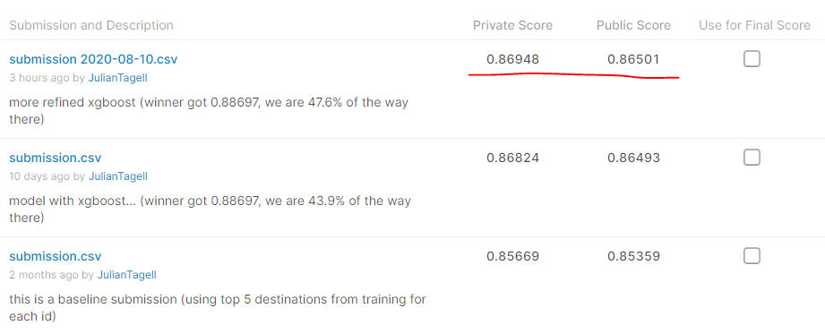

# Airbnb Kaggle Comp

## What's this all about?
This is my revisiting of an old Kaggle competition. Official page: https://www.kaggle.com/c/airbnb-recruiting-new-user-bookings

Kaggle still allows late submissions, for this comp, which is handy, for our purposes.

## How does this repo work?

I am aiming to do this ML implementation with the drake package. "What's drake?", you ask.
https://books.ropensci.org/drake/

Currently have made a little progress towards the winner's score:

## About the challenge

We basically have to predict the *first country visited* by new AirBnB customers.

Basically, you have 5 guesses for each customer’s destination country (including “no destination”). You get reducing points, the lower down your correct guess is.

You can just guess the top 5 countries (overall) for each person and you’ll get a score of 0.85359 (there is no penalty for incorrect guesses). The team that won the competition got 0.88697.

